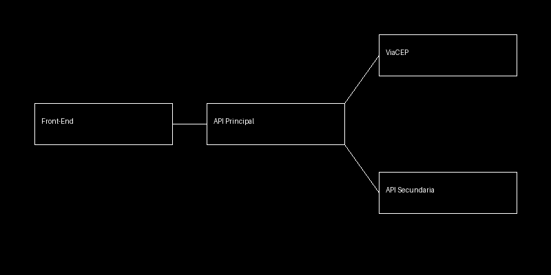

# ARP Medical - API Principal

API REST responsável pelo gerenciamento de produtos, insumos e vendas.

## Descrição

Esta API implementa as regras de negócio do sistema de estoque da ARP Medical, incluindo controle de produtos, insumos e vendas. Também realiza integração com uma API externa (ViaCEP) e com uma API secundária para cálculo de distância.

## Tecnologias

- Python
- FastAPI
- SQLite

## Funcionalidades

- Cadastro, edição, listagem e remoção de produtos
- Cadastro, edição, listagem e remoção de insumos
- Registro de vendas
- Controle automático de estoque
- Consulta de endereço por CEP
- Cálculo de distância entre empresa e fornecedor

## Rotas principais

### Produtos
- GET /produtos
- POST /produtos
- PUT /produtos/{id}
- DELETE /produtos/{id}

### Insumos
- GET /insumos
- POST /insumos
- PUT /insumos/{id}
- DELETE /insumos/{id}

### Vendas
- GET /vendas
- POST /vendas

### Outros
- GET /cep/{cep}
- GET /insumos/{id}/distancia

## API externa utilizada

### ViaCEP
- URL: https://viacep.com.br/
- Tipo: pública e gratuita
- Uso: consulta de endereço a partir do CEP
- Não requer autenticação

## Como executar com Docker

```bash
docker build -t arp-api-principal .
docker run -d -p 8000:8000 arp-api-principal

## Arquitetura

